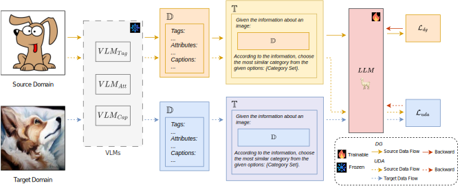

# VLLaVO: Mitigating Visual Gap through LLMs

This is the offical code of VLLaVO.



Firstly, we extract the descriptions of an images by VLMs (CLIP and BLIP), then finetuning LLM (LLaMA) with the descriptions.
The finetuned LLM can be used to do classification.


# Prepare model

All model we used in the following list:
- CLIP https://huggingface.co/laion/CLIP-ViT-H-14-laion2B-s32B-b79K
- BLIP https://huggingface.co/Salesforce/blip-image-captioning-large
- LLaMA2-7B-chat-hf https://huggingface.co/meta-llama/Llama-2-7b-chat-hf
- FLAN-T5 https://huggingface.co/t5-base


There are some commands for understanding the code.

# Description Extract

Demos:

```CUDA_VISIBLE_DEVICES=1 python descriptions_extractor.py -s dataset/office_home/image_list/Product.txt --save_path ../datasets/Office_home --base_path dataset/office_home/```

# Finetune 

See `DG_llama.sh` in `./script/bash_command` for LLM model llama2.

# Evaluate

See `classification_llama.sh` for LLM model llama2. 

