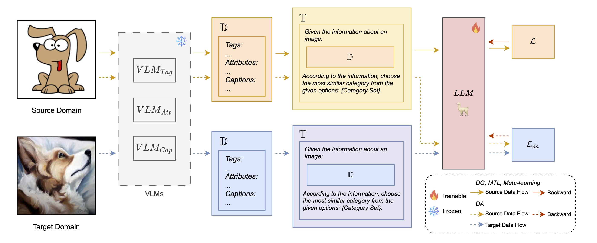

# LLaVO: Large Language models as Visual cross-dOmain learners

This is the offical code of LLaVO.



Firstly, we extract the descriptions of an images by VLMs (CLIP and BLIP), then finetuning LLM (LLaMA) with the descriptions.
The finetuned LLM can be used to do classification.


# Prepare model

All model we used in the following list:
- CLIP https://huggingface.co/laion/CLIP-ViT-H-14-laion2B-s32B-b79K
- BLIP https://huggingface.co/Salesforce/blip-image-captioning-large
- LLaMA2-7B-chat-hf https://huggingface.co/meta-llama/Llama-2-7b-chat-hf
- FLAN-T5 https://huggingface.co/t5-base

# Prepare dataset

## Directly download existing dataset

We offer the dataset used in our paper on the following link: [dataset link](https://www.dropbox.com/scl/fo/brzjl4xzpfzf0r57tkkwr/h?rlkey=zxeabnjpkgbbpwugskpcjzrqa&st=79p516or&dl=0)

## Description Extract

If you want to extract the descriptions to construct the dataset by yourself, the following codes can be used.

```CUDA_VISIBLE_DEVICES=1 python descriptions_extractor.py -s dataset/office_home/image_list/Product.txt --save_path ../datasets/Office_home --base_path dataset/office_home/```


# Finetune 

See `DG_llama.sh` in `./script/bash_command` for LLM model llama2.

# Evaluate

See `classification_llama.sh` for LLM model llama2. 

